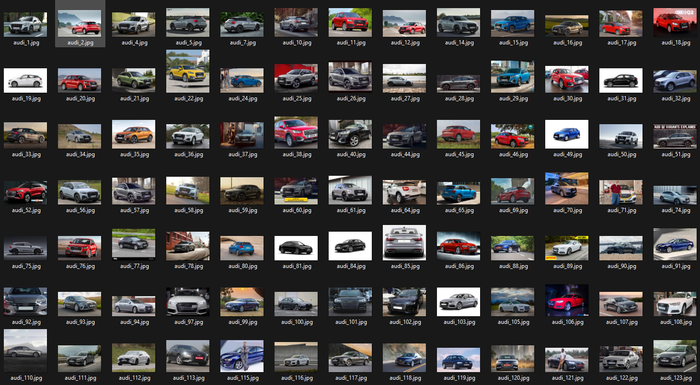
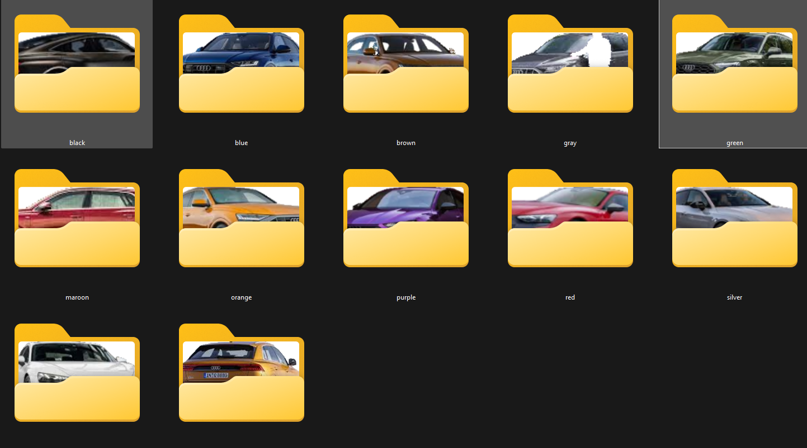

# sam2vit

*Center-focused* background removal with SAM 2 and prompt-based classification with CLIP and YOLO.

This project segments the primary subject near the image center using SAM 2, paints the background white, then classifies each image using OpenAI CLIP with a structured prompt set. Images are saved to output subfolders named after the predicted class/item.

Yolo11 was tested with `yolo11x-seg.pt` model.

Yolo can be pre-processed (with `--yolo` as optional or `-require-yolo` as required) or required after sam2 segment with `post-process-yolo

> Example cars dataset: https://www.kaggle.com/datasets/kshitij192/cars-image-dataset

Prefixes/Items/Postfixes:

```json
{
    "prefixes": [
        "a vehicle that is", "a car that is",
        "a vehicle painted", "a car painted",
        "a vehicle with", "a parked vehicle that is",
        "a moving vehicle that is"
    ],
    "items": [
        "red", "blue",
        "green", "yellow",
        "black", "white",
        "silver", "gray",
        "orange", "brown",
        "purple", "pink",
        "gold", "maroon",
        "cyan"
    ],
    "postfixes": [
        "colored car", "colored vehicle",
        "vehicle", "car",
        "painted vehicle", "painted car"
    ]
}
```

| Input | Output |
|-------|--------|
|||

## Key features

- SAM 2 center-focused segmentation (center point + margin refinement)
- Background painted white; output as RGBA
- Prompt builder (prefix × items × postfix) for dense CLIP scoring
- YOLOv11 for pre-proccessing or postprocessing
- CLIP-based top-prompt selection and result reorganization
- Device-aware execution: CUDA, Apple MPS, or CPU (MPS CPU fallback supported)

## How it works (pipeline)

 - Input image → (optional) YOLO → SAM 2 segmentation (center seed + margin refinement) with Background painted white (RGBA) → (optional post processing) yolo → Prompt set built from prefixes/items/postfixes → CLIP scores all prompts → Best prompt selected → Image saved to output/<item>/

## Requirements

- Python 3.10+
- PyTorch (match your CUDA/MPS/CPU environment)
- OpenAI CLIP
- ultranalytics yolo 11
- Optional for visualization only: matplotlib, opencv-python, ultranalytics

## Installation

1) Install PyTorch suitable for your OS and GPU drivers (CUDA/MPS/CPU).
2) Install project dependencies and CLIP.
3) Ensure the SAM 2 package and configs exist under `sam2/configs/sam2.1/`.
4) Download the SAM 2 checkpoint into `./checkpoints/` (e.g., `sam2.1_hiera_large.pt`).

Example (adjust versions for your system):

```bash
pip install -e .
pip install numpy pillow rich
pip install git+https://github.com/openai/CLIP.git
# Install torch / torchvision matching your CUDA or CPU. See https://pytorch.org/get-started/locally/
```

## Usage

1. Prepare the `config.json` (yolo settings if needed, prefixes, items and postfixes for the subject you want):
```json
  {
    // YOLO:
    "yolo_model": "yolo11x-seg.pt",
    "yolo_confidence_threshold": 0.5,
    "yolo_prompts": ["flower", "rose"], // if yolo is enabled, it will crop the objects with these labels (whitelisted) - from the largest to the smallest (returns the largest with the matching label or none. If required, it won't be processed and moved to folder `unknown`)

    // CLIP:
    "prefixes": [
        "a", "a beautiful", "a colorful"
    ],
    "items": ["flower", "rose"],
    "postfixes": ["in a jar", "in a cup"]
    
    // Example output for clip interrogating:
    // - a flower in a cup
    // - a beautiful rose in a jar
}
```
1. Prepare inputs in a folder (e.g., `cars_input/`), and make sure `cars_output` is empty or non-existant.

2. Execute __(example)__:
```bash
python main.py --input_dir cars_input --output_dir cars_output --require_yolo --post_process_yolo
```

**Output**:

 - For each image in directory `cars_input`:
   - `--require-yolo` will run a yolo check based on `--yolo_prompts`
   - SAM2 processing (no `--no-sam`)
   - `--post-process-yolo` supplied - another verification on the segmentation via yolo
   - CLIP will be interrogated based on `prefixes`x`items`x`prefixes` and a folder will be created on directory `cars_output` with the `item` name from the prompt
   - It will save the image cropped as `original_image` is not set.

### Flags:

| Flag | Short | Type | Default | Action / Choices | Description |
|---|---:|---|---:|---|---|
| `--input_dir` | `-i` | str | `_input` | required | Path to the dataset directory |
| `--output_dir` | `-o` | str | `_output` | required | Path to the output directory |
| `--no_sam` | `-x` | bool | `False` | `store_true` | Skip SAM2 segmentation (use original image for CLIP) |
| `--output_original` | — | bool | `False` | `store_true` | Save original image instead of segmented output |
| `--yolo` | — | bool | `False` | `store_true` | Run YOLO as a pre-processing step |
| `--require_yolo` | — | bool | `False` | `store_true` | Require YOLO to detect a class to pass image forward (enables YOLO) |
| `--post_process_yolo` | — | bool | `False` | `store_true` | Run YOLO after SAM2 and require its prediction to accept the result |
| `--sam_model` | — | str | `sam2.1_hiera_large` | — | SAM2 checkpoint name |
| `--sam_config` | — | str | `sam2.1_hiera_l` | — | SAM2 config name |
| `--clip_model` | `-c` | str | `ViT-L/14@336px` | — | CLIP model variant |
| `--device` | `-d` | str | `cuda` | choices: `cpu`, `cuda` | Compute device |
| `--seed` | `-S` | int | `3` | — | Random seed for reproducibility |
| `--show_image` | `-g` | bool | `False` | `store_true` | Display image after processing (requires matplotlib/opencv) |
| `--log_level` | `-l` | str | `INFO` | `TRACE,DEBUG,INFO,WARNING,ERROR,CRITICAL` | Console log level |
| `--file_log_level` | `-u` | str | `TRACE` | `TRACE,DEBUG,INFO,WARNING,ERROR,CRITICAL` | File log level |
| `--file_log_name` | `-w` | str | `app.log` | — | Log file name |
| `--file_log_rotation` | `-r` | str | `100 MB` | — | Log rotation size |
| `--file_log_no_reset` | `-z` | bool | `False` | bool | Do not remove/reset the log file on boot |
| `--positive_scale_pin` | `-p` | float | `30` | — | Scale (pixels) for positive SAM2 points |
| `--negative_scale_pin` | `-n` | float | `0` | — | Scale (pixels) for negative SAM2 points |

The program prints device info and prompt counts. Results save to `{{ output_dir }}/<item>/<image>.png`, where `output_dir` is `--output_dir`, `<item>` is the `config.json` item that it was recognized with and `<image>` is the real image name to `.png`

## Configuration

- `config.json` contains three arrays: `prefixes`, `items`, and `postfixes`.
- These are combined to form prompts: `prefix + item + postfix`.
- See `main.py` for how they’re loaded; see `clip_model.py` and `config.py` for CLIP behaviour (config's `def get_prompts(self) -> List[str]`).
-  - `config.json` also has `yolo_` configurations of model name, confidence threshold and valid prompts (which are whitelisted objects to look for in the image)

## Customization

- Change `items`, `prefixes`, and `postfixes` in `config.json` to adapt to other domains (e.g., apparel, furniture, produce).
- Switch to a smaller CLIP model via `--clip-model` (or `-c`): e.g., `ViT-B/32`) for speed.
- Adjust `mask_threshold` (in `main.py` call to `predict_sam2`) to widen/tighten the focal region.
- Modify `predict_sam2()` to place different points or to write the mask into the alpha channel for true transparency.

## Edge cases and behaviors

### Image characteristics
- Very small images: the margin-based refinement can collapse to overlapping points; consider lowering `mask_threshold` or skipping refinement.
- Extremely large images: may cause OOM on limited GPUs; resize inputs or switch to a smaller CLIP model via `--clip-model` (or `-c`).
- Non-RGB inputs (grayscale/CMYK): converted to RGB internally; colors may shift slightly.
- Low contrast foreground/background: SAM 2 may segment poorly; we should adjust margin or provide custom prompts/points.

### File handling
- Output extension is `.png`; inputs with other extensions will be saved as PNG.

### Prompting and CLIP
- Prompt collisions: if different prompts tokenize similarly, probabilities may be close; consider diversifying prefixes/postfixes.
- Long prompts: CLIP tokenizes up to a maximum length (model-dependent, often 77 tokens); very long strings will be truncated.
- Class leakage: prefixes/postfixes should maintain spacing so items remain distinct tokens.

### Devices and performance
- Device selection: SAM 2 can run on CUDA, MPS, or CPU; CLIP on CUDA or CPU. MPS CPU fallback is enabled via `PYTORCH_ENABLE_MPS_FALLBACK=1`.
- Mixed devices: SAM 2 and CLIP can run on different devices; see `main.py` for selection and `cuda_device.py` for checks.
- Precision/TF32: On CUDA, BF16 autocast and TF32 (Ampere+) can be enabled for speed; see `cuda_device.py`.

### Dependencies
- Optional: `matplotlib` and `opencv-python` are only needed for visualization utilities; core flow runs without them.

### Operational scenarios
- `--no-sam`: classification runs on the original image; useful to compare CLIP-only vs SAM+CLIP.
- Empty prompt lists: ensure `config.json` arrays are non-empty; otherwise CLIP will get an empty set.
- Missing checkpoints/configs: verify files exist at paths built by `get_checkpoint_path()` and `get_model_cfg_path()`.
- `yolo`/`require_yolo` to enable yolo pre-processing or `post_process_yolo` for post-processing (after SAM)

## Workflow

- If `--yolo` is set, it will try to segment the image-unless `--require_yolo`, then it's a must segment the image
- SAM2 processing
- If `--post-processing-yolo` is active, it will run YOLO after SAM2 (in case SAM2 crops wrongly)
- Runs `CLIP` on |`prefix`|x|**item**|x|`postfix`|

## Troubleshooting

**CUDA not available / out of memory**
  - Reduce batch size (images are processed singly here), resize inputs, or switch to CPU/MPS.
  - Use a smaller CLIP model.

**CLIP not installed**
  - Install via `pip install git+https://github.com/openai/CLIP.git`.

**SAM 2 config/checkpoint not found**
  - Ensure `sam2/configs/sam2.1/<name>.yaml` and `checkpoints/<model>.pt` exist.

**No yolo model**
  - Download from ultranalytics the yolo*-seg.pt file

**No images processed**
  - Confirm `--input_dir` path and supported extensions. Check logs with `--debug`.

## Roadmap

### ✅ Done
- [x] Center-focused segmentation via SAM 2 (center seed + margin refinement)
- [x] Background painted white; RGBA output
- [x] Prompt builder (prefix × items × postfix) and CLIP scoring pipeline
- [x] Device-aware execution (CUDA, MPS, CPU) with MPS CPU fallback
- [x] Config-driven prompts via `config.json`
- [x] Optional no-SAM flow (`--no-sam`) for CLIP-only classification
- [x] Debug logging and console table output
- [x] Edge cases and troubleshooting documentation
- [x] Optional object detector (YOLO) to get the main object in image

### ⚠️ Planned (priority top to bottom)

- [ ] Multiple output scenario:
  - [x] RAW **(<output_dir>/[item from clip]/_original_image_name_.png)**
  - [ ] YOLO for training (training with bounding boxes from SAM2, output with other file requirements like 1 text per image)
  - [ ] SAM2 for training from YOLO
  - [ ] CLIP for training from output in simpler prompts
- [ ] Pluggable background handling (white vs. true transparency)
- [ ] Central position may be changed in the future as it's hardcoded.

## Acknowledgements

- SAM 2: https://github.com/facebookresearch/sam2/
- CLIP: https://github.com/openai/CLIP
- YOLO: https://ultralytics.com
## License

Apache License 2.0. See `LICENSE` for more details.
