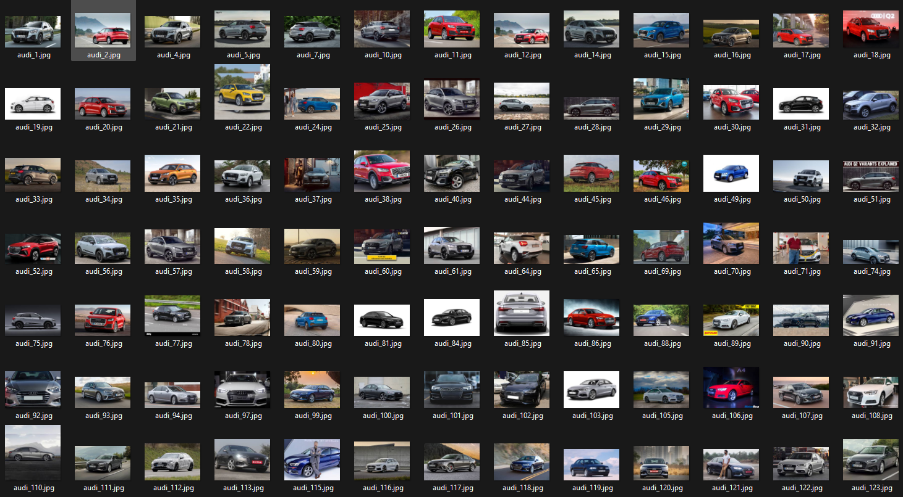
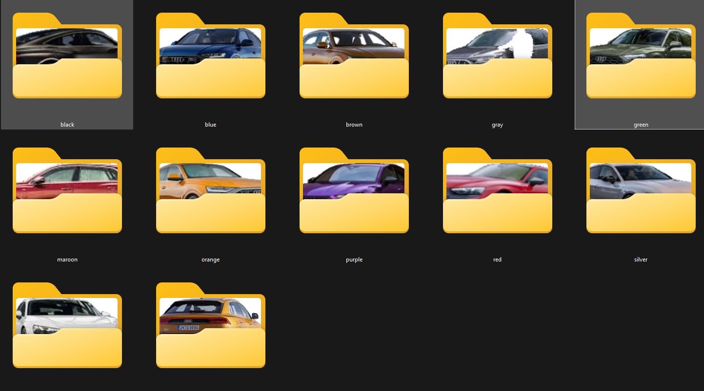

# Image Assets – Non‑Source Documentation

The `images/` folder contains only visual assets that illustrate the project's structure and functionality. These assets are **not** part of the executable source code or build artifacts; they exist solely to support documentation, features and design reviews.

All project images are presented below for quick reference:

|                                              |                                               |
|----------------------------------------------|-----------------------------------------------|
|                           |                          |
|  via `python gr_app.py` |  via `python gr_app.py` |

> Some assets should be referenced by the root's `README.md`.

**Reminder:** The images may not represent the final project.
